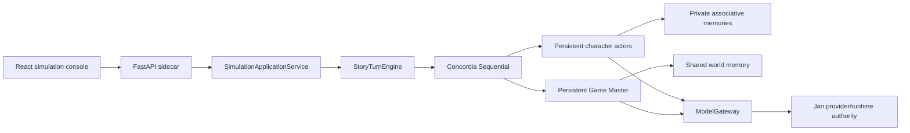

# Architecture

AI Story Evolution Engine runs as a local desktop system: Jan owns model
providers and execution, the Python sidecar owns story simulation and durable
state, and React provides project, simulation, branch, and manuscript views.

## Runtime boundary

`gdm-concordia==2.4.0` is the only Entity/Component/Engine implementation.
Story-specific code supplies Prefabs, recipes, locale/pacing components,
memory codecs, persistence, and HTTP application services.

Every step asks the Game Master whether to terminate, produces observations,
selects the next actor with `NEXT_ACTING`, creates a dynamic
`NEXT_ACTION_SPEC`, obtains an actor action, and resolves that putative action
into a world event. Actor text never becomes world truth without Game Master
resolution.

## Durable state

The branch head checkpoint is canonical for a running simulation. A checkpoint
contains actor/component state, Game Master state, private/shared memory
snapshots, current step, raw-log offset, locale, status, and a canonical SHA-256
state hash.

The commit order is:

1. Write and verify the content-addressed checkpoint.
2. Append the step result and trace to the branch JSONL log.
3. Compare-and-swap the branch manifest head under the project lock.

A failure before step 3 can leave unreachable data, but never a branch head
that references a missing checkpoint. Model calls occur outside filesystem
locks. One live writer is allowed per project branch.

Markdown under `.story-engine/projections/<branch>/` is a disposable human
view. World, timeline, and character projections can be deleted and rebuilt
from a selected checkpoint without affecting recovery. Project Markdown still
provides editable seed material and manuscript export.

## Privacy and locale

Each character owns a separate memory bank. The Game Master sees world truth
and all project seed facts; characters receive only public seed facts, their
own restricted facts, and observations routed to them. Memory snapshots retain
owner and scope metadata and are hash-verified.

`content_locale` controls generated prose and prompts. IDs, enums, tags,
references, paths, and hashes remain locale-independent. UI locale remains a
front-end concern.

## Control and recovery

The session API supports start, get, step, run, pause, resume, terminate, and
explicit checkpoint operations. Control policies expose step, scene, chapter,
and autonomous modes plus hard step, runtime, token, and failure budgets.
Branch APIs create a branch from any project checkpoint, roll a branch head
back, and rebuild projections.

WebSocket events report simulation start, step completion, pause, checkpoint,
termination, failure, and resynchronization. HTTP state remains authoritative
when an event is missed.

## Model access and observability

`ModelGateway` is the only provider boundary. Runtime model tasks are `actor`,
`game_master`, `reflection`, `memory_consolidation`, `projection`, `editor`,
`writer`, and `embedding`. Every Concordia bridge call can record profile,
provider, model, prompt version/hash, components, memory sources, token counts,
duration, retries, and structured errors in the step trace.
